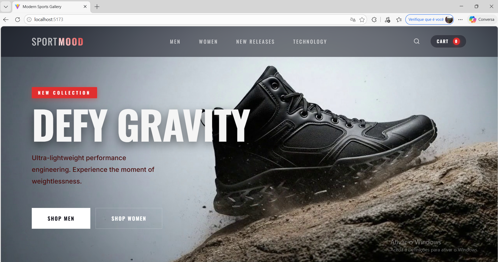

# ⚡ Antigravity — SportMood Landing Page

O projeto inclui uma animação personalizada desenvolvida previamente(whisk, Veo 3), que serviu como base para a construção do site utilizando uma plataforma baseada em Anti-Gravity para acelerar o desenvolvimento da interface.
Uma landing page  para uma marca de calçados esportivos de luxo. O projeto apresenta uma animação em sequência de frames de um tênis flutuando em anti-gravidade, criando uma experiência visual imersiva e premium.

---
## 📸 Screenshot

<p align="center">
  
</p>

---

## ✨ Demonstração

> A animação exibe uma sequência de 80 frames de um tênis em slow-motion, simulando o efeito anti-gravidade com renderização cinematográfica e iluminação dramática.

---

## 🛠️ Tech Stack

| **React** | 
| **Vite** | 
| **Vanilla CSS** | 
| **Whisk** | 
| **Veo 3** | 
| **(https://imagem.online-convert.com/pt)** | 


---

## 🗂️ Estrutura do Projeto

```
antigravity/
├── src/
│   ├── assets/
│   │   └── images/images/     # Sequência de frames (0–79) para a animação
│   ├── App.jsx                # Componente principal com animação e layout
│   ├── App.css                # Estilos do layout e componentes
│   ├── index.css              # Design system global (tokens, reset, tipografia)
│   └── main.jsx               # Entry point do React
├── index.html                 # HTML raiz
├── vite.config.js             # Configuração do Vite
└── package.json
```

### Instalação e execução

bash

npm install

npm run dev


Acesse **http://localhost:5173** no navegador.


